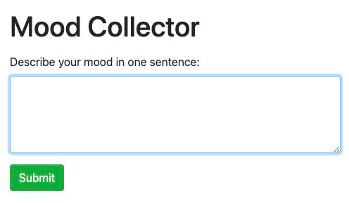

# A Simple Natural Language Processing Web App
As the name suggests, this is an application that collects users' mood. What it does? 
1. Receives a sentence from the user
2. Performs sentiment classification 
3. Stores these information into the database

<br/>

A picture is worth a thousand words 😃 <br/>


<br/>
<br/>

# Setup
Tech stack: Node.js, Express.js, Bootstrap, MongoDB Atlas, Tensorflow <br/><br/>
Install modules for the Python script. For more information, please refer to the [official website](https://www.tensorflow.org/install).
```
% pip install -r requirements.txt
```

<br/>
<br/>

# How To Run 
In the project directory, run `nodemon index.js` in the terminal. Hit `localhost:3000` in the browser. Enter a sentence and hit the submit button. Go back to the terminal and you will see the following messages showing that the application is running in the desired sequence. <br/>
```
db is connected
Received input in /save: <input>
Receiving data from Python script ...
Exit child process with code 0
Successful! Saving to database
```

<br/>
<br/>

# Natural Language Processing Trained Model
The model and the tokenizer were saved beforehand. Interested to know more about the training process of a NLP model? Visit this repo [NLP-Sentiment140](https://github.com/Sins-Repo/NLP-Sentiment140)

<br/>
<br/>

# Output 
The user interface <br/>



The collections in the MongoDB Atlas <br/>


<br/>
<br/>

# Discussion
May consider cleaning the input text before tokenization. For more information, visit this repo [NLP-Sentiment140](https://github.com/Sins-Repo/NLP-Sentiment140)
```
def clean_text(x):
  text = x
  text = text.lower()                 # convert to lower case
  text = re.sub('\[.*?\]', '', text)  # remove square brackets
  text = re.sub(r'[^\w\s]','',text)   # remove punctuation
  text = re.sub('\w*\d\w*', '', text) # remove words containing numbers
  text = re.sub('\n', '', text)       # remove carriage return
  text = re.sub('((www.[^s]+)|(https?://[^s]+))',' ',text) # remove URL
  text = text.split()
  stop_words = set(stopwords.words('english')) # remove stopwords
  text = [w for w in text if not w in stop_words] 
  lemma = nltk.wordnet.WordNetLemmatizer()     # lemmatization
  text = ' '.join([lemma.lemmatize(word) for word in text])
```

